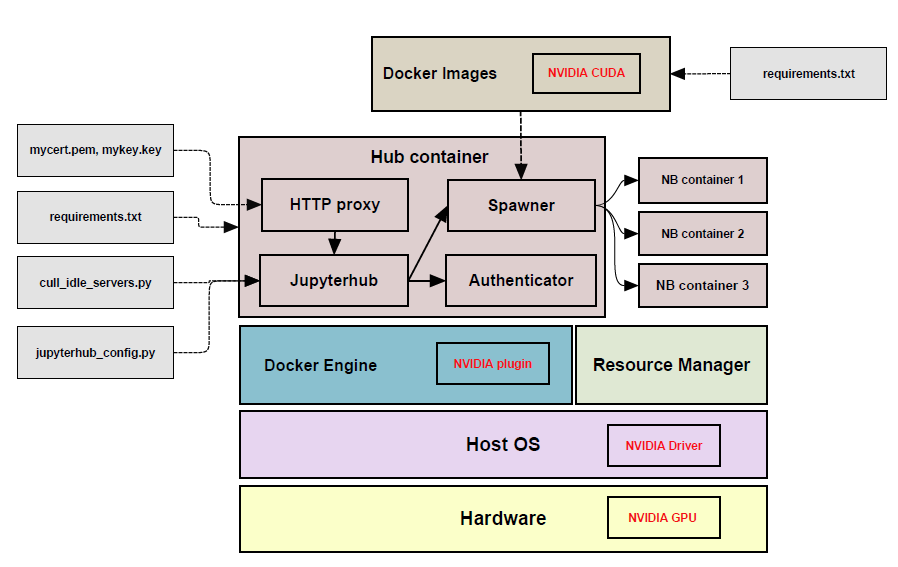

# jupyterhub-dockerspawner
This (incomplete) repo shows how to setup a containerized jupyterhub service on a single-node GPU server.

## Current version:
- is under developement access via `http://localhost:8080`
- CPU version is also possible with small changes 
- is sccessfully tested on Ubuntu `16.04` and `18.04`
- CPU version is tested on `Windows 10`
- uses dummy authentication
- user data is persistent
- hub data is not persistent for development reasons
- host docker socket is bind mounted into the hub container (may not work on a host with Windows OS)
- uses Nvidia runtime for GPU
- spawner calss is dockerspawner
- spawner options for notebook images are available 
- shared directory between notebooks
- add portainer service access via `http://localhost:9000`

### Directory and files structure:
```
Jupyterhub-setup
├── cull_idle_servers.py
├── docker-compose.yaml
├── Dockerfile
├── images
│   ├── make-all-images.sh
│   ├── tensorflow-v2-cpu
│   │   └── Dockerfile
│   └── tensorflow-v2-gpu
│       └── Dockerfile
├── jupyterhub_config.py
├── mycert.pem
├── mykey.key
└── requirements.txt
```

### Flowchart of the current jupyterhub setup on GPU:



## Dependencies:
make sure that the most updated dependencies are install and working flawlessly
- [docker-engine](https://docs.docker.com/install/) 
- [docker Nvidia plugin](https://github.com/NVIDIA/nvidia-docker)
- [docker-compose](https://docs.docker.com/compose/install/)

## __How to run docker-based jupyterhub:__

make all notebook images
```
cd images
./make-all images
```
create docker network for the jupyterhub internal connection
```
docker network create jupyterhub-network
```

create docker volume for the jupyterhub shared directory
```
docker volume create jupyterhub-shared
```

run jupyterhub server
```
docker-compose build -f docker-compose.yaml
docker-compose up -d
```

to see the logs
```
docker-compose logs
```

## __How to delete the service:__
stop and remove containers
```
docker-compose down 
```

remove the created network
```
docker network rm jupyterhub-network
```

remove user data volumes
```
docker container prune
docker volume prune 
```
please be careful with the `prune` command, it removes __all unused__ containers and volumes from the docker.

## Useful links:
- [https://github.com/jupyterhub/dockerspawner](https://github.com/jupyterhub/dockerspawner)


## Snapshots:
login -> spawn a selected image -> notebook with GPU access


